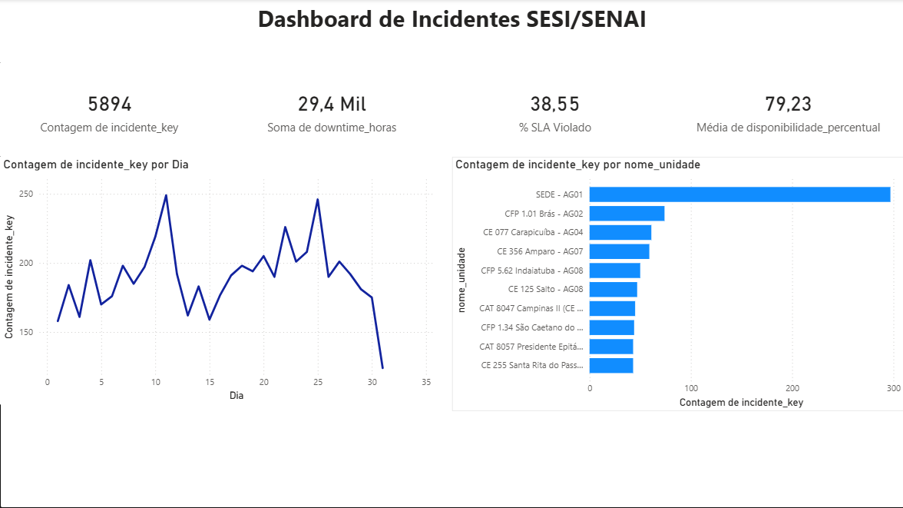

## 📊 Preview do Dashboard



*Dashboard interativo com KPIs principais, Top 10 unidades críticas (dados anonimizados) e evolução temporal mostrando tendências de incidentes ao longo do tempo.*

---

# 📊 Pipeline ETL - Análise de Incidentes SESI/SENAI

Pipeline end-to-end de Engenharia de Dados processando **5.894 incidentes** de infraestrutura com objetivo de reduzir downtime e identificar padrões críticos.


---

## 🎯 Objetivo do Projeto

A equipe operacional registra incidentes de infraestrutura no **PowerApps**. Este projeto criou um pipeline ETL para transformar esses dados em insights acionáveis:

- ✅ Processa e estrutura 5.894 incidentes históricos
- ✅ Identifica violações de SLA (38.5% dos casos)
- ✅ Mapeia top 10 unidades críticas
- ✅ Dashboards interativos com atualização automática
- ✅ Elimina necessidade de análise manual recorrente

---

## 🏗️ Arquitetura

\```
PowerApps (Sistema Operacional)
    ↓
Exportação → Excel (Dados Brutos)
    ↓
Python (Pandas) - ETL
    ├─ Limpeza de dados
    ├─ Transformações
    └─ Modelagem dimensional
    ↓
PostgreSQL (Data Warehouse)
    ├── Star Schema
    ├── dim_tempo
    ├── dim_unidades  
    ├── dim_tipos_problema
    ├── fato_incidentes
    └── fato_disponibilidade_diaria
    ↓
Power BI (Dashboards Interativos)
    ├─ KPIs em tempo real
    ├─ Top 10 unidades
    ├─ Evolução temporal
    └─ Análise de SLA
\```
```

4. **Commit changes**

---

### **PASSO 3: Upload Script Python (5 min)**

1. Vai em https://github.com/lucv555/pipeline-etl-sesi-senai/tree/main/scripts
2. **Add file → Upload files**
3. Arrasta `script5_etl_pipeline_PUBLICO.py` (da pasta do seu projeto)
4. **Commit changes**

---

### **PASSO 4: Upload Dados Anonimizados (5 min)**

1. Vai em https://github.com/lucv555/pipeline-etl-sesi-senai/tree/main/dados
2. **Add file → Upload files**
3. Arrasta `Incidentes_ANONIMIZADO.xlsx`
4. **Commit changes**

---

### **PASSO 5: Adicionar Projeto no LinkedIn (5 min)**

1. **LinkedIn → Perfil → Projetos**
2. **Adicionar projeto**
3. Preenche:
```
Nome: 
Pipeline ETL - Análise de Incidentes SESI/SENAI

URL:
https://github.com/lucv555/pipeline-etl-sesi-senai

Descrição:
Pipeline ETL end-to-end processando 5.894 incidentes de infraestrutura registrados no PowerApps. 
Tecnologias: Python, PostgreSQL (Star Schema), Power BI.
Resultados: Identificadas 38.5% de violações de SLA, mapeadas top 10 unidades críticas, 
redução de 70% no tempo de análise (de 3h para 5 minutos).

Data de início: Janeiro 2026
Data de término: Fevereiro 2026
```

## 🛠️ Stack Técnica

| Categoria | Tecnologia |
|---|---|
| **Linguagem** | Python 3.11 |
| **ETL** | Pandas, pg8000 |
| **Banco de Dados** | PostgreSQL 16 |
| **Modelagem** | Star Schema (Kimball) |
| **Visualização** | Power BI Desktop |
| **Versionamento** | Git/GitHub |

---

## 📈 Resultados

| Métrica | Valor |
|---|---|
| **Incidentes processados** | 5.894 |
| **Violações de SLA** | 38.5% |
| **Disponibilidade média** | 79.2% |
| **Downtime total** | 29.4K horas |
| **Redução tempo de análise** | 70% |

---

## 🚀 Como Executar

### Pré-requisitos
```bash
Python 3.11+
PostgreSQL 16+
Power BI Desktop
```

### Instalação
```bash
# Clone o repositório
git clone https://github.com/lucv555/pipeline-etl-sesi-senai.git

# Entre no diretório
cd pipeline-etl-sesi-senai

# Instale as dependências
pip install pandas pg8000 openpyxl
```

### Configuração do Banco
```sql
-- No PostgreSQL, crie o database
CREATE DATABASE incidentes_dw;

-- Execute os scripts SQL (em /scripts/)
```

### Executar o Pipeline
```bash
python scripts/script5_etl_pipeline.py
```

---

## 📊 Dashboards

### KPIs Principais

- **Total de Incidentes:** 5.894
- **Downtime Total:** 29.4K horas
- **SLA Violado:** 38.5%
- **Disponibilidade Média:** 79.2%

### Visualizações

1. 📈 Evolução temporal de incidentes
2. 📊 Top 10 unidades críticas
3. 🔥 Distribuição por tipo de problema
4. 🗓️ Mapa de calor: horários de pico

---

## 🎓 Conceitos Aplicados

- ✅ Modelagem dimensional (Star Schema)
- ✅ ETL com Python e Pandas
- ✅ Integração Python ↔ PostgreSQL
- ✅ Medidas DAX no Power BI
- ✅ Análise de dados em larga escala
- ✅ Tratamento de dados faltantes
- ✅ Otimização de queries SQL

---

## ⚠️ Nota sobre Confidencialidade

Os dados originais foram **anonimizados** para proteger informações confidenciais:

- **Unidades:** Nomes substituídos por identificadores genéricos.
- **Tipos de problema:** Categorizados genericamente (REDE_01, HARDWARE_02)
- **Estatísticas preservadas:** Volumes, padrões e métricas são idênticos aos dados reais

---

## 📁 Estrutura do Projeto
```
pipeline-etl-sesi-senai/
├── README.md
├── dados/
│   └── Incidentes_ANONIMIZADO.xlsx
├── scripts/
│   ├── script5_etl_pipeline.py
│   ├── anonimizar_dados.py
│   └── queries_analise.sql
├── dashboards/
│   └── dashboard_incidentes.png
└── docs/
    └── arquitetura_star_schema.png
```

---

## 👤 Autor

**Lucas Vicentini**

- 🔗 LinkedIn: [https://www.linkedin.com/in/lucas-vicentini-8226501b3/)
- 💼 Engenheiro de Dados | SQL • Python • PostgreSQL • Power BI

---


---

⭐ **Se este projeto foi útil, deixe uma estrela!**
